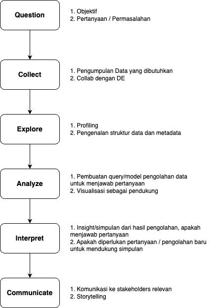
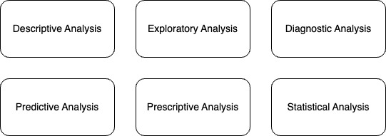
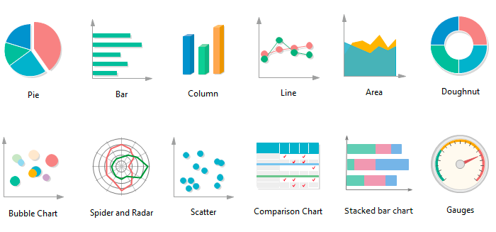
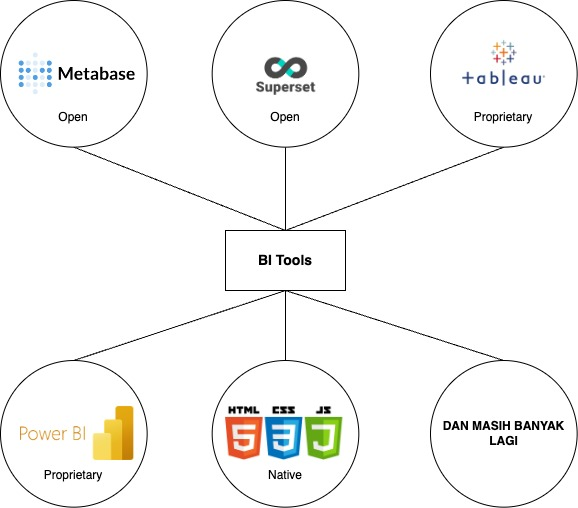
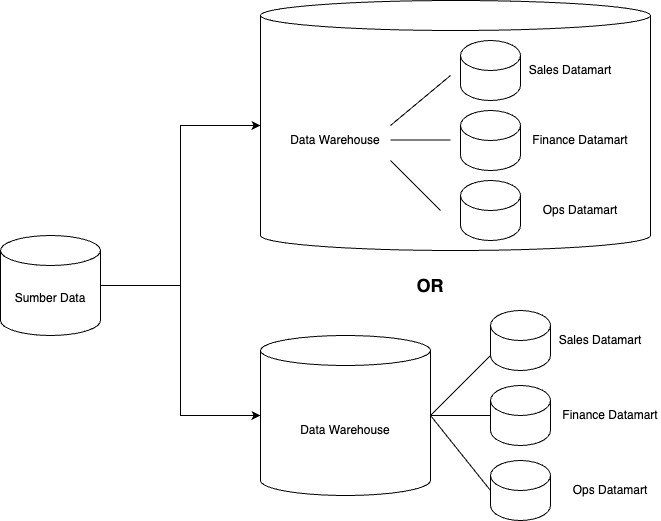
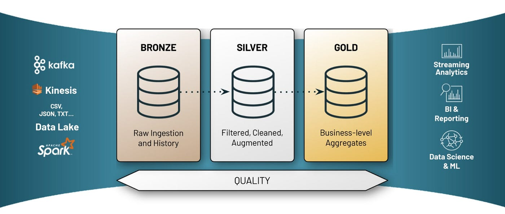
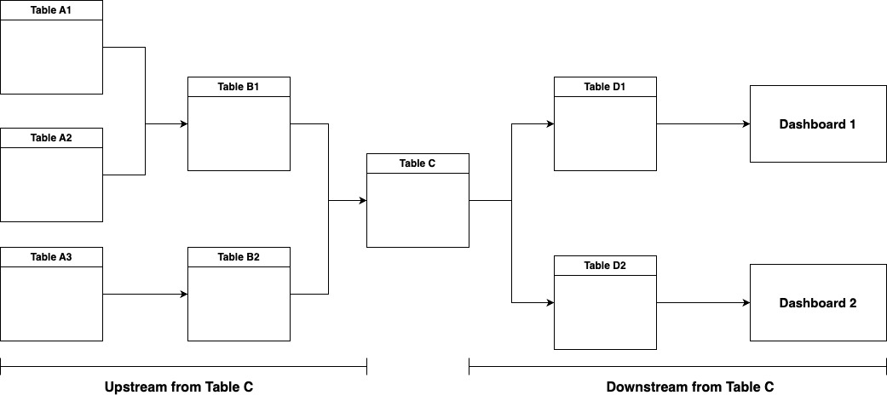
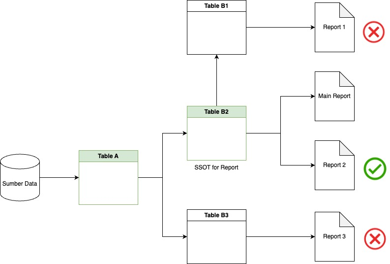

# Data analysis

Content :
- [Siklus Data Analysis](./readme.md#data-analysis-cycle)
- [Metode Data Analysis](./readme.md#data-analysis-method)
- [Visualisasi Data](./readme.md#data-visualization)
- [Datamart](./readme.md#datamart-usage)
- [Data Lineage](./readme.md#data-lineage)

## Siklus Data Analysis

prev |
[next](./readme.md#data-analysis-method)

## Metode Data Analysis

[prev](./readme.md#data-analysis-cycle) |
[next](./readme.md#data-visualization)

## Visualisasi Data

### Tipe-tipe Visualisasi

### BI Tools

[prev](./readme.md#data-analysis-method) |
[next](./readme.md#datamart-usage)

## Datamart

### Datawarehouse vs Datamart

### Medallion Layer

[prev](./readme.md#data-visualization) |
[next](./readme.md#data-lineage)

## Data Lineage

### Upstream dan Downstream

### Data Lineage in Report (untuk SSOT)

[prev](./readme.md#datamart-usage) | next

Sumber & Referensi :
- [Online Slide](https://jrladd.com/DA101/slides/ethics#/title-slide)
- [Data Science Dojo](https://datasciencedojo.com/blog/data-analysis-methods/)
- [Medium](https://medium.com/@sdhglobal/ai-data-visualization-types-examples-and-tools-4c018cc88e39)
- [Medium](https://piethein.medium.com/medallion-architecture-best-practices-for-managing-bronze-silver-and-gold-486de7c90055)