# Data Ingestion

Content :
- [Definisi Data Ingestion](./readme.md#what-data-ingestion)
- [Tipe Data Ingestion](./readme.md#data-ingestion-type)
- [Extract, Transform, Load](./readme.md#extract-transform-load)
- [Quality Check](./readme.md#quality-check)

## Definisi Data Ingestion

### Apa itu Data Ingestion
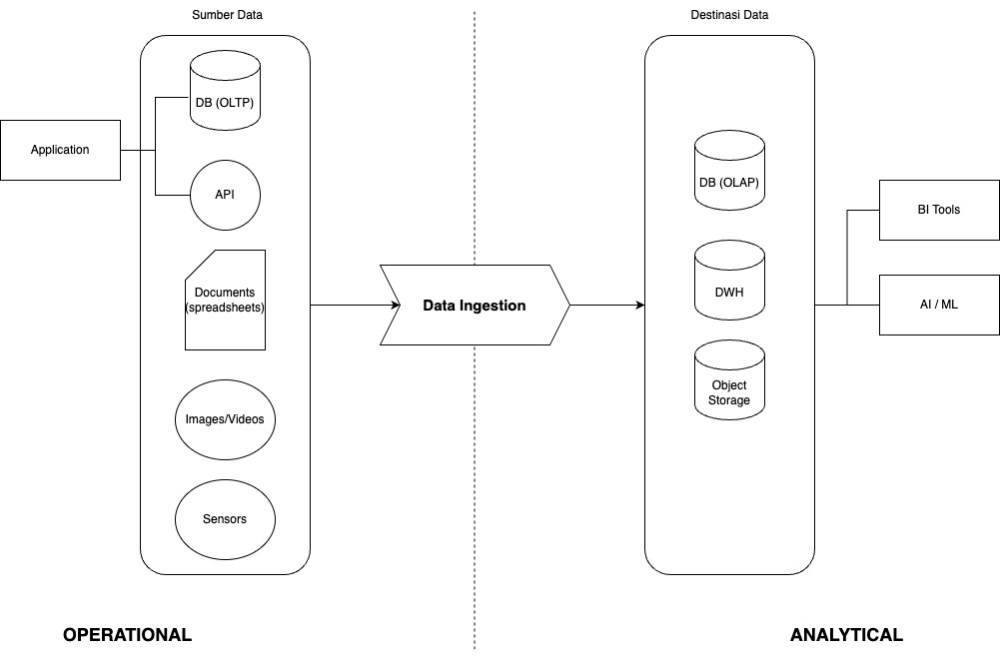

### Push vs Pull
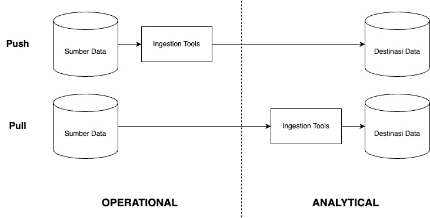

prev |
[next](./readme.md#data-ingestion-type)

## Tipe Data Ingestion

### Unified Data Repository
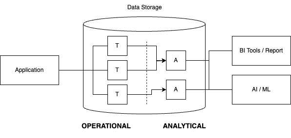

### Extract Transform Load
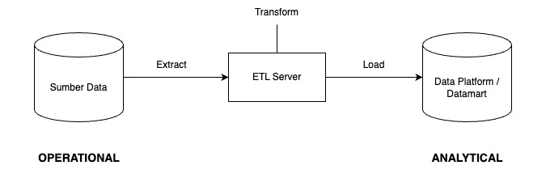

### Extract Load Transform
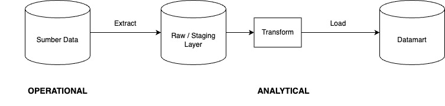

### Stream Processing
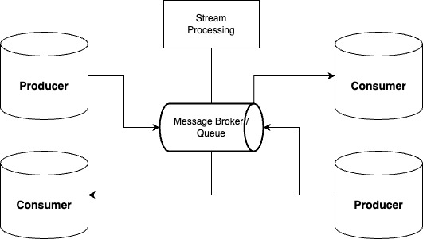

[prev](./readme.md#what-data-ingestion) |
[next](./readme.md#extract-transform-load)

## Extract, Transform, Load

### Prinsip ETL
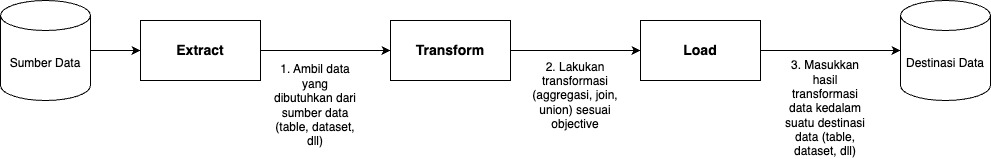

### ETL Tools
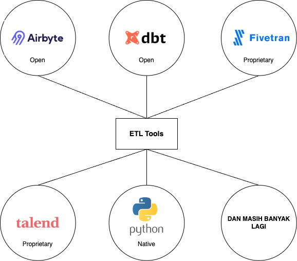

### Schedule ETL
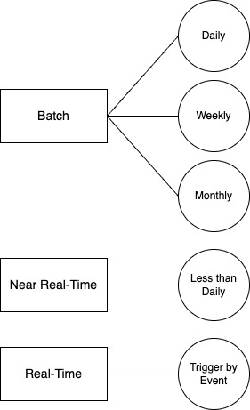

[prev](./readme.md#data-ingestion-type) |
[next](./readme.md#quality-check)

## Quality Check
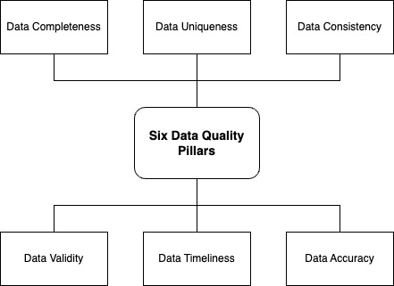

### Data Completeness
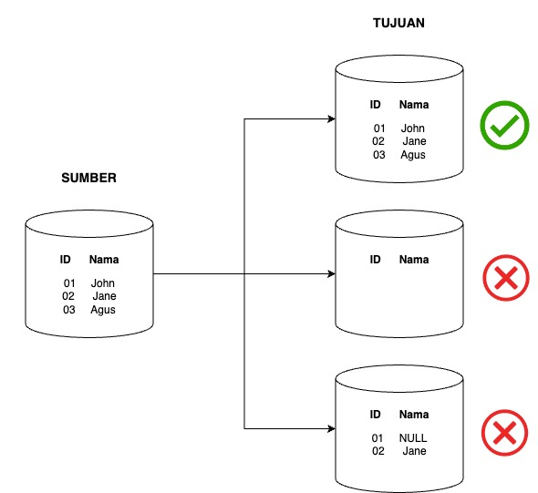

### Data Uniqueness

### Data Timeliness
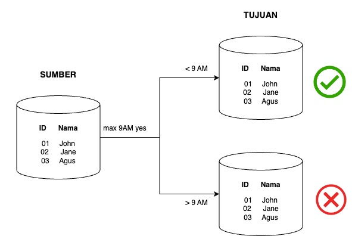

### Data Consistency
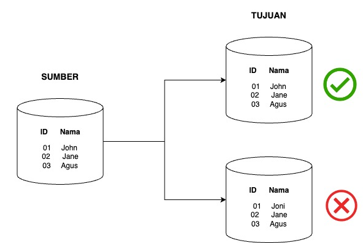

### Data Validity
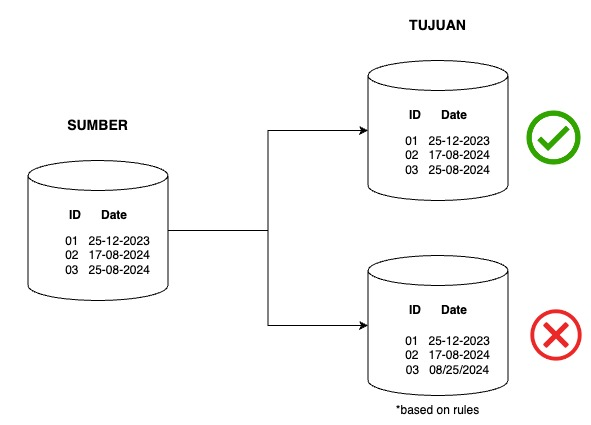

### Data Accuracy
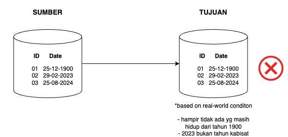

[prev](./readme.md#extract-transform-load) | next

Sumber & Referensi :
[Medium](https://medium.com/the-modern-scientist/the-art-of-data-ingestion-powering-analytics-from-operational-sources-467552d6c9a2)
